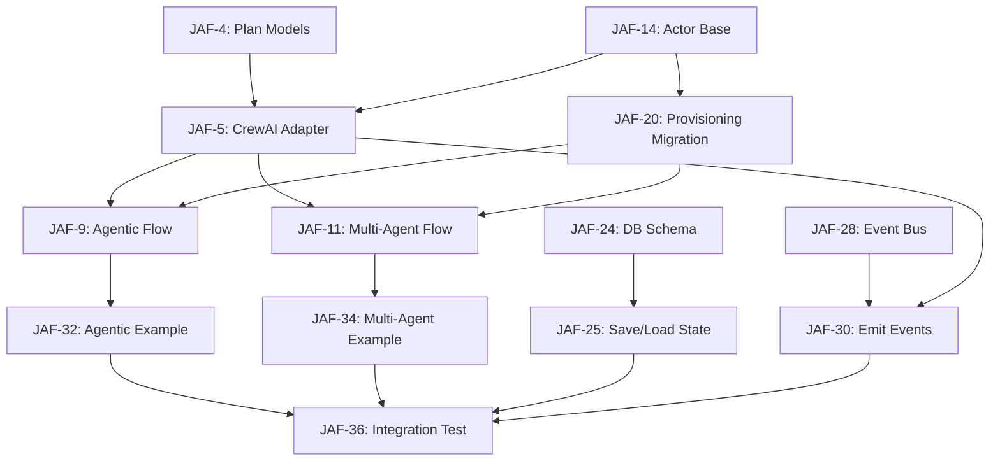

# Jems AI Framework (JAF) - Final Backlog (4-Week Sprint)

**Project:** JAF - Jems AI Framework
**Project Key:** JAF
**Timeline:** 4 weeks (FIXED - no extensions)
**Team:** 4 Developers + 2-3 Supervisors
**Capacity:** ~20 story points/week (80 total)

**Governance:**

- **Team Lead / Senior Architect:** Alex - Technical leadership, architecture, team coordination
- **Product Owner:** Alexey - Go/No-Go decisions, scope approval, stakeholder communication
- **Sponsor:** Alexey (Budget from Nicholas) - Budget authority, escalation point
- **Stakeholder:** Nicholas (Co-CEO) - Final sign-off, business value validation, strategic direction
- **Decision Flow:** Dev Team → Alex (Team Lead) → Alexey (PO) → Nicholas (if needed)

---

## Work Streams (Parallel Execution)

| Stream                                         | Lead Dev      | Focus Area                                | JAF Stories      |
| ---------------------------------------------- | ------------- | ----------------------------------------- | ---------------- |
| **Stream A: Actor SDK**                        | Dev 3         | Actor base class, registry, migrations    | JAF-13 to JAF-21 |
| **Stream B: Engine Core** ⚠️ **CRITICAL PATH** | Dev 1 + Dev 2 | Engine abstraction, CrewAI adapter, flows | JAF-1 to JAF-12  |
| **Stream C: Persistence & Events**             | Dev 4         | Database, state management, event bus     | JAF-22 to JAF-30 |
| **Stream D: Integration**                      | All Devs      | Examples, tests, polish                   | JAF-31 to JAF-37 |

**Supervisors:** 2-3 (Code reviews, architecture guidance, unblocking)

---

## Definition of Done (DoD)

A task/user story is considered "Done" when:

1. ✅ **Code Complete:** All code written, reviewed, and merged to `v3-add-v0`
2. ✅ **Tests Pass:** Unit tests written (>70% coverage), integration tests pass
3. ✅ **Documentation:** Code documented (docstrings + inline comments)
4. ✅ **Type Safety:** All type hints added, mypy passes
5. ✅ **Linting:** Code passes black, flake8/isort checks
6. ✅ **Integration:** Works with existing system (backward compatible)
7. ✅ **Demo-Ready:** Can demonstrate the feature working end-to-end

---

## Priority Focus

**Critical Path (Must Have):**

1. **Engine Abstraction** (JAF-1, JAF-2) - The core execution engine
2. **Actor Base Class** (JAF-13, JAF-14) - Foundation for all actors
3. **CrewAI Adapter** (JAF-5) - Backward compatibility ⚠️ **HIGHEST RISK**
4. **Agentic Flow** (JAF-9, JAF-32) - Demo outcome #1
5. **Multi-Agent Flow** (JAF-11, JAF-34) - Demo outcome #2

**Nice-to-Have (Can Defer):**

- Traditional Automation (JAF-38) - Defer to Week 5+
- Advanced persistence features - Basic save/load sufficient
- SSE endpoint (JAF-30) - Console events OK for MVP
- CLI tools - Post-launch
- Extensive documentation - Basic docstrings sufficient

---

## Key Design Principles

1. **Actor Model** - "Share Nothing" architecture, actors communicate via messages only
2. **Engine Abstraction** - Vendor independence, can swap execution backends
3. **Hybrid Intelligence** - Mix cheap LLM (gpt-4o-mini) with expensive LLM (gpt-4o) or no LLM
4. **Persistence-First** - Every state transition saved to Postgres for crash recovery
5. **Backward Compatibility** - Existing CrewAI code must work during migration

---

## 4-Week Milestone Plan

### Week 1: Foundation - Actor + Engine Interface ⚡

**Goal:** Establish Actor abstraction and Engine interface
**Story Points:** 20

**Friday Demo:**

- Show Actor base class with example actor
- Show Engine interface defined
- Show Plan data models working
- ProvisionningAgent migration started (20%)

---

### Week 2: Execution - CrewAI Adapter + Agentic Flow 🚀

**Goal:** Working engine with CrewAI adapter, first flow type
**Story Points:** 22

**Friday Demo:**

- CrewAI Adapter executes single step
- Agentic flow example working (1 orchestrator + tools)
- ProvisionningAgent fully migrated
- Process state saves to DB
- Events log to console

---

### Week 3: Multi-Agent + Events 🌊

**Goal:** Multi-agent flows working, event bus integrated
**Story Points:** 20

**Friday Demo:**

- Multi-agent flow example working (orchestrator delegates)
- Event bus emits AgentAction events
- Process resumes after crash (DB restore)
- Real-time events stream (console or SSE if ready)

---

### Week 4: Integration + Polish 🎬

**Goal:** End-to-end examples, integration tests, demo-ready
**Story Points:** 18

**Friday Demo - CLIENT PRESENTATION:**

1. **Outcome 1:** Agentic Flow (cost: $0.05, latency: 2s)
2. **Outcome 2:** Multi-Agent Flow (cost: $0.12, latency: 5s)
3. **Show:** Crash recovery, event streaming
4. **Show:** Code examples, architecture diagram

---

## Weekly Stream Breakdown (Revised)

| Week       | Stream A (Dev 3)                                              | Stream B (Dev 1 + Dev 2)                                                                                                       | Stream C (Dev 4)                                                                           | Cross-Stream                                                                  |
| ---------- | ------------------------------------------------------------- | ------------------------------------------------------------------------------------------------------------------------------ | ------------------------------------------------------------------------------------------ | ----------------------------------------------------------------------------- |
| **Week 1** | Actor base + Registry<br>(JAF-14/15/16/17/18/19)<br>**8 pts** | Engine interface + Plan models<br>(JAF-2/3/4)<br>Dev 1: **7 pts**<br>CrewAI adapter planning<br>Dev 2: **3 pts**               | DB schema + Event bus design<br>(JAF-24/28/29)<br>**5 pts**                                | Architecture reviews                                                          |
| **Week 2** | Provisioning migration<br>(JAF-20/21)<br>**5 pts**            | CrewAI adapter implementation<br>(JAF-5/6/7/8)<br>Dev 2: **8 pts**<br>Agentic flow support<br>(JAF-9/10)<br>Dev 1+2: **5 pts** | Persistence save/load<br>(JAF-25)<br>**3 pts**<br>Event bus basic<br>(JAF-28)<br>**3 pts** | Integration testing                                                           |
| **Week 3** | Provisioning complete + docs<br>**2 pts**                     | Multi-agent flow<br>(JAF-11/12)<br>Dev 2: **8 pts**<br>Multi-agent example prep<br>(JAF-34)<br>Dev 1: **3 pts**                | Event bus complete<br>(JAF-30)<br>**2 pts**<br>SSE endpoint (if time)<br>**3 pts**         | Weekly sync, blockers                                                         |
| **Week 4** | Final actor polish<br>**2 pts**                               | Multi-agent example complete<br>(JAF-35)<br>Dev 2: **5 pts**<br>Agentic example<br>(JAF-32/33)<br>Dev 1: **3 pts**             | SSE integration + polish<br>**3 pts**                                                      | Integration tests<br>(JAF-36/37)<br>All devs: **5 pts**<br>Demo prep (JAF-26) |

**Total Points by Week:** Week 1: 20, Week 2: 22, Week 3: 20, Week 4: 18 = **80 points**

---

# EPIC 1: Engine Abstraction (CRITICAL PATH) 🔥

**Epic ID:** JAF-1
**Epic Type:** Epic
**Stream:** B (Engine Core)
**Priority:** HIGHEST
**Story Points:** 35
**Milestone:** Week 1-3

**Summary:** Build the Engine abstraction - the core execution engine

**Description:**
The Engine is the heart of the framework. It manages process planning, execution, and evaluation. This epic establishes the `EngineAbstraction` interface and implements the CrewAI adapter to maintain backward compatibility.

**Acceptance Criteria:**

- Engine abstraction interface defined (JAF-2)
- CrewAI adapter implemented (JAF-5)
- Agentic flow support working (JAF-9)
- Multi-agent flow support working (JAF-11)

**Risk Level:** ⚠️ **HIGH** - If engine is wrong, everything breaks
**Mitigation:** Prototype in Week 1, architecture review with all supervisors before Week 2

---

## Feature 1.1: Engine Abstraction Interface

**Issue ID:** JAF-2
**Issue Type:** Feature
**Parent:** JAF-1
**Stream:** B
**Priority:** HIGHEST
**Story Points:** 7
**Assignee:** Dev 1
**Milestone:** Week 1

**Summary:** Define EngineAbstraction abstract base class

**Description:**
Create the `EngineAbstraction` interface in `framework/engine/engine_abstraction.py` that defines the contract for all execution engines. This is the foundation for the entire framework.

**Acceptance Criteria:**

- `EngineAbstraction(ABC)` class defined
- Methods: `generate_plan()`, `execute_step()`, `evaluate_progress()`
- All methods properly typed with async support
- Plan data models defined (Plan, PlanStep, StepResult)

**Dependencies:** None (START HERE)

---

### User Story: Define Engine Interface

**Issue ID:** JAF-3
**Issue Type:** Story
**Parent:** JAF-2
**Stream:** B
**Priority:** HIGHEST
**Story Points:** 3
**Assignee:** Dev 1
**Milestone:** Week 1

**Summary:** As the framework, I need an engine interface so I can swap execution backends

**Description:**
Define the abstract methods that all engines must implement:

- `async def generate_plan(goal: str, available_actors: List[Actor]) -> Plan`
- `async def execute_step(step: PlanStep, context: dict) -> StepResult`
- `async def evaluate_progress(plan: Plan, recent_result: StepResult) -> PlanUpdate`

**Acceptance Criteria:**

- Interface defined in `framework/engine/engine_abstraction.py`
- All methods are abstract and async
- Type hints for all parameters and returns
- Docstrings explain each method's purpose

**Technical Notes:**

```python
# framework/engine/engine_abstraction.py
from abc import ABC, abstractmethod
from typing import List
from framework.types import Plan, PlanStep, StepResult, PlanUpdate, Actor

class EngineAbstraction(ABC):
    """The heart of JAF - manages process lifecycle."""

    @abstractmethod
    async def generate_plan(self, goal: str, available_actors: List[Actor]) -> Plan:
        """Phase 1: PROCESS PLANNING - Break goal into steps."""
        pass

    @abstractmethod
    async def execute_step(self, step: PlanStep, context: dict) -> StepResult:
        """Phase 2: PROCESS EXECUTION - Execute single step."""
        pass

    @abstractmethod
    async def evaluate_progress(self, plan: Plan, result: StepResult) -> PlanUpdate:
        """Phase 3: EVALUATION - Decide next action."""
        pass
```

---

### Task: Create Plan Data Models

**Issue ID:** JAF-4
**Issue Type:** Task
**Parent:** JAF-3
**Stream:** B
**Priority:** HIGHEST
**Story Points:** 2
**Assignee:** Dev 1
**Milestone:** Week 1

**Summary:** Define Plan, PlanStep, StepResult, PlanUpdate data models

**Description:**
Create Pydantic models for plan-related data structures used by the engine interface. These are critical for type safety across the framework.

**Acceptance Criteria:**

- `Plan` model with steps list and status
- `PlanStep` model with actor_name, tool_name, parameters
- `StepResult` model with status, output, error
- `PlanUpdate` model for plan modifications
- All models in `framework/types.py`
- JSON serialization/deserialization works

**Technical Notes:**

```python
# framework/types.py
from pydantic import BaseModel
from typing import List, Dict, Any, Optional, Literal

class PlanStep(BaseModel):
    id: str
    actor_name: str
    tool_name: str
    parameters: Dict[str, Any]

class Plan(BaseModel):
    steps: List[PlanStep]
    status: Literal["PLANNING", "EXECUTING", "COMPLETED", "FAILED"]

class StepResult(BaseModel):
    output: Dict[str, Any]
    status: Literal["success", "error"]
    error: Optional[str] = None

class PlanUpdate(BaseModel):
    action: Literal["continue", "modify", "abort"]
    modified_plan: Optional[Plan] = None
```

**Dependencies:** Must complete BEFORE JAF-5 (CrewAI Adapter)

---

## Feature 1.2: CrewAI Adapter Implementation ⚠️ **CRITICAL**

**Issue ID:** JAF-5
**Issue Type:** Feature
**Parent:** JAF-1
**Stream:** B
**Priority:** HIGHEST
**Story Points:** 13
**Assignee:** Dev 2 (+ Dev 1 for code review)
**Milestone:** Week 2

**Summary:** Implement CrewAIAdapter that wraps CrewAI execution

**Description:**
Create `CrewAIAdapter` class that implements `EngineAbstraction` by wrapping existing CrewAI logic. This allows immediate use of new framework with existing CrewAI code.

**⚠️ RISK:** This is the highest-risk story. If wrong, blocks all Week 2-3 work.

**Mitigation Strategy:**

1. Week 1: Prototype basic structure, review with supervisors
2. Week 2 Day 1-2: Implement `execute_step()` first (most critical)
3. Week 2 Day 3: Integration test with ProvisionningActor
4. Week 2 Day 4-5: Implement `generate_plan()` and `evaluate_progress()`

**Acceptance Criteria:**

- `CrewAIAdapter(EngineAbstraction)` implemented in `framework/engine/crewai_adapter.py`
- All three abstract methods working
- Works with ProvisionningActor (migrated to Actor pattern)
- Backward compatible with existing orchestrator
- Integration test passes

**Dependencies:**

- JAF-4 (Plan models) **MUST BE COMPLETE**
- JAF-14 (Actor base class) **MUST BE COMPLETE**
- JAF-20 (Provisioning migration) **MUST START**

---

### User Story: CrewAI Adapter - Generate Plan

**Issue ID:** JAF-6
**Issue Type:** Story
**Parent:** JAF-5
**Stream:** B
**Priority:** HIGHEST
**Story Points:** 3
**Assignee:** Dev 2
**Milestone:** Week 2 (Day 4-5)

**Summary:** As the engine, I need to generate a plan from a goal using CrewAI

**Description:**
Implement `generate_plan()` method that uses CrewAI's planning capabilities or LLM to break down a goal into steps.

**Acceptance Criteria:**

- Method accepts goal string and available actors
- Uses CrewAI Task/Crew or LLM to create plan
- Returns `Plan` object with steps
- Handles errors gracefully
- Unit test passes

---

### User Story: CrewAI Adapter - Execute Step ⚡ **START HERE**

**Issue ID:** JAF-7
**Issue Type:** Story
**Parent:** JAF-5
**Stream:** B
**Priority:** HIGHEST
**Story Points:** 5
**Assignee:** Dev 2
**Milestone:** Week 2 (Day 1-2)

**Summary:** As the engine, I need to execute a single plan step using CrewAI

**Description:**
Implement `execute_step()` that runs a single step by creating a mini-Crew with the relevant actor and executing one turn. **This is the most critical method - implement FIRST.**

**Acceptance Criteria:**

- Method accepts `PlanStep` and context
- Creates CrewAI Agent from Actor
- Executes single turn (one tool call)
- Returns `StepResult` with output/error
- Handles CrewAI-specific errors (timeout, invalid tool, etc.)
- Integration test with ProvisionningActor passes

**Technical Notes:**

```python
# Pseudocode
async def execute_step(self, step: PlanStep, context: dict) -> StepResult:
    # 1. Get Actor from registry
    actor = ActorRegistry.get(step.actor_name)

    # 2. Create CrewAI Agent
    crew_agent = Agent(
        role=actor.name,
        goal=step.tool_name,
        backstory=actor.description,
        tools=actor.tools,
        llm=self._get_llm(actor.llm_config)
    )

    # 3. Create Task
    task = Task(
        description=f"Execute {step.tool_name} with params {step.parameters}",
        agent=crew_agent
    )

    # 4. Run Crew (single turn)
    crew = Crew(agents=[crew_agent], tasks=[task], process=Process.sequential)
    result = crew.kickoff()

    # 5. Map to StepResult
    return StepResult(output=result, status="success")
```

---

### User Story: CrewAI Adapter - Evaluate Progress

**Issue ID:** JAF-8
**Issue Type:** Story
**Parent:** JAF-5
**Stream:** B
**Priority:** HIGH
**Story Points:** 2
**Assignee:** Dev 2
**Milestone:** Week 2 (Day 5)

**Summary:** As the engine, I need to evaluate plan progress after each step

**Description:**
Implement `evaluate_progress()` that checks if the plan is still valid or needs modification based on step results.

**Acceptance Criteria:**

- Method accepts plan and recent result
- Uses LLM or rules to evaluate
- Returns `PlanUpdate` (continue/modify/abort)
- Handles edge cases (step failed, unexpected output)

---

## Feature 1.3: Agentic Flow Support

**Issue ID:** JAF-9
**Issue Type:** Feature
**Parent:** JAF-1
**Stream:** B
**Priority:** HIGHEST
**Story Points:** 5
**Assignee:** Dev 1 + Dev 2
**Milestone:** Week 2

**Summary:** Engine must support agentic flows (1 orchestrator + tools)

**Description:**
Ensure engine can execute workflows where a single orchestrator actor uses multiple tools without delegating to other agents. This is **Demo Outcome #1**.

**Acceptance Criteria:**

- Can generate plan for single-actor workflow
- Can execute tools directly (no delegation)
- Example test case passes (JAF-32)
- Cost analysis shows ~$0.05/workflow

**Dependencies:** JAF-5 (CrewAI Adapter) must be working

---

### User Story: Agentic Flow Execution

**Issue ID:** JAF-10
**Issue Type:** Story
**Parent:** JAF-9
**Stream:** B
**Priority:** HIGHEST
**Story Points:** 3
**Assignee:** Dev 1 + Dev 2
**Milestone:** Week 2

**Summary:** As the engine, I need to support agentic flows (1 orchestrator + tools)

**Description:**
Implement and test agentic flow mode where orchestrator gets all tools flattened (no sub-agents).

**Acceptance Criteria:**

- Engine detects single-actor workflow
- Flattens all tools into orchestrator
- No sub-agent delegation occurs
- Integration test passes
- Performance: <2s latency, <$0.05 cost

---

## Feature 1.4: Multi-Agent Flow Support

**Issue ID:** JAF-11
**Issue Type:** Feature
**Parent:** JAF-1
**Stream:** B
**Priority:** HIGHEST
**Story Points:** 8
**Assignee:** Dev 2 (+ Dev 1 for integration)
**Milestone:** Week 3

**Summary:** Engine must support multi-agent flows (orchestrator + agents with nested processes)

**Description:**
Ensure engine can execute workflows where orchestrator delegates to multiple agent actors, and those agents can have nested sub-processes. This is **Demo Outcome #2** - the key differentiator.

**Acceptance Criteria:**

- Can generate plan with multiple actors
- Can execute actor-to-actor delegation
- Supports nested process execution (actor calls sub-actor)
- Example test case passes (JAF-34)
- Cost analysis shows ~$0.12/workflow

**Dependencies:** JAF-9 (Agentic flow) must be working first

---

### User Story: Multi-Agent Flow Execution

**Issue ID:** JAF-12
**Issue Type:** Story
**Parent:** JAF-11
**Stream:** B
**Priority:** HIGHEST
**Story Points:** 8
**Assignee:** Dev 2
**Milestone:** Week 3

**Summary:** As the engine, I need to support multi-agent flows with delegation

**Description:**
Implement multi-agent flow mode where orchestrator can delegate to specialized actors, and actors can spawn sub-processes.

**Acceptance Criteria:**

- Engine routes steps to specific actors
- Actors can call other actors (nested delegation)
- Context/memory shared correctly
- Integration test passes
- Performance: <5s latency, <$0.15 cost

**Technical Notes:**

```python
# Orchestrator delegates:
Plan([
    PlanStep(actor="PiramidActor", tool="classify_identity"),
    PlanStep(actor="ProvisionningActor", tool="provision_pc"),
    PlanStep(actor="GeaiActor", tool="create_email")
])

# ProvisionningActor can internally call HabilitationActor:
# This requires nested process support
```

---

# EPIC 2: Actor Foundation 🏗️

**Epic ID:** JAF-13
**Epic Type:** Epic
**Stream:** A (Actor SDK)
**Priority:** HIGHEST
**Story Points:** 20
**Milestone:** Week 1-2

**Summary:** Build the foundational Actor abstraction

**Description:**
This epic establishes the `Actor` base class that serves as the atomic unit of functionality. Actors can be deterministic (no LLM) or probabilistic (with LLM).

**Acceptance Criteria:**

- Actor base class defined with clear interface
- Support for both LLM-enabled and LLM-free actors
- Actor registry system for discovery
- ProvisionningAgent migrated as pilot

**Risk Level:** MEDIUM - Blocks agent migrations
**Mitigation:** Parallel work with Engine (JAF-1), can use simple Actor stub initially

---

## Feature 2.1: Actor Base Class

**Issue ID:** JAF-14
**Issue Type:** Feature
**Parent:** JAF-13
**Stream:** A
**Priority:** HIGHEST
**Story Points:** 8
**Assignee:** Dev 3
**Milestone:** Week 1

**Summary:** Define and implement the Actor abstract base class

**Description:**
Create the `Actor` base class in `framework/actor/base_actor.py` that defines the contract for all actors in the framework.

**Acceptance Criteria:**

- `Actor` ABC defined with required methods: `configure()`, properties: `name`, `description`, `goal`
- Support for optional `llm_config: Optional[LLMConfig]`
- Support for `tools: List[Callable]` and `utilities: List[Callable]`
- Type hints for all attributes and methods
- Example stub actor works

**Dependencies:** None (can start immediately)

---

### User Story: Actor Interface Definition

**Issue ID:** JAF-15
**Issue Type:** Story
**Parent:** JAF-14
**Stream:** A
**Priority:** HIGHEST
**Story Points:** 3
**Assignee:** Dev 3
**Milestone:** Week 1

**Summary:** As a framework developer, I need an Actor base class so that all actors follow the same contract

**Description:**
Define the abstract `Actor` class with all required attributes and methods.

**Acceptance Criteria:**

- `Actor` ABC exists in `framework/actor/base_actor.py`
- Attributes: `name: str`, `description: str`, `goal: str`, `tools: List[Callable]`, `llm_config: Optional[LLMConfig]`
- Abstract method: `configure()`
- Class can be instantiated (with concrete subclass)
- Docstrings explain usage

**Technical Notes:**

```python
# framework/actor/base_actor.py
from abc import ABC, abstractmethod
from typing import List, Callable, Optional
from framework.types import LLMConfig

class Actor(ABC):
    """System Object from whiteboard - atomic unit of work.

    Actors are hybrid: can be deterministic (no LLM) or probabilistic (with LLM).
    They follow the Actor Model: share nothing, communicate via messages only.
    """

    name: str
    description: str
    goal: str
    tools: List[Callable] = []
    utilities: List[Callable] = []
    llm_config: Optional[LLMConfig] = None  # None = deterministic (no AI)

    @abstractmethod
    def configure(self):
        """Setup tools, LLM, utilities. Called once on initialization."""
        pass
```

---

### Task: Define LLMConfig Data Class

**Issue ID:** JAF-16
**Issue Type:** Task
**Parent:** JAF-15
**Stream:** A
**Priority:** HIGHEST
**Story Points:** 2
**Assignee:** Dev 3
**Milestone:** Week 1

**Summary:** Create LLMConfig dataclass for Actor LLM configuration

**Description:**
Define a Pydantic model for LLM configuration including model name, temperature, max_tokens, etc.

**Acceptance Criteria:**

- `LLMConfig` class defined in `framework/types.py` (Pydantic model)
- Fields: `model: str`, `temperature: float`, `max_tokens: Optional[int]`
- Validation logic for model names (gpt-4o, gpt-4o-mini, etc.)
- Type hints and docstrings

**Technical Notes:**

```python
# framework/types.py
from pydantic import BaseModel, Field
from typing import Optional

class LLMConfig(BaseModel):
    """LLM configuration for Actor."""
    model: str = Field(..., description="Model name (e.g., gpt-4o, gpt-4o-mini)")
    temperature: float = Field(0.0, ge=0.0, le=2.0, description="Temperature (0-2)")
    max_tokens: Optional[int] = Field(None, gt=0, description="Max tokens (optional)")
```

---

## Feature 2.2: Actor Registry System

**Issue ID:** JAF-17
**Issue Type:** Feature
**Parent:** JAF-13
**Stream:** A
**Priority:** HIGH
**Story Points:** 5
**Assignee:** Dev 3
**Milestone:** Week 1

**Summary:** Build actor discovery and registry system

**Description:**
Create a registry that can discover, register, and retrieve actors at runtime.

**Acceptance Criteria:**

- `ActorRegistry` class exists in `framework/actor/registry.py`
- Can register actors by name: `register(name, actor_class)`
- Can retrieve actor instances: `get(name) -> Actor`
- Can discover actors from `agents.yaml`
- Singleton pattern (global registry)

---

### User Story: Actor Registration

**Issue ID:** JAF-18
**Issue Type:** Story
**Parent:** JAF-17
**Stream:** A
**Priority:** HIGH
**Story Points:** 2
**Assignee:** Dev 3
**Milestone:** Week 1

**Summary:** As the framework, I need to register actors so they can be discovered at runtime

**Description:**
Implement actor registration mechanism that allows actors to be registered by name and retrieved later.

**Acceptance Criteria:**

- `ActorRegistry.register(name, actor_class)` method works
- `ActorRegistry.get(name)` returns actor instance
- Registry is singleton/global
- Thread-safe (if needed for async)

---

### User Story: Actor Discovery from YAML

**Issue ID:** JAF-19
**Issue Type:** Story
**Parent:** JAF-17
**Stream:** A
**Priority:** HIGH
**Story Points:** 2
**Assignee:** Dev 3
**Milestone:** Week 1

**Summary:** As the framework, I need to discover actors from `agents.yaml` automatically

**Description:**
Scan `agents.yaml` file and auto-register all defined actors. This maintains backward compatibility with current system.

**Acceptance Criteria:**

- Reads `agents.yaml` file
- Parses actor definitions
- Registers each actor found
- Handles missing/invalid entries gracefully
- Logs warnings for unregistered actors

---

## Feature 2.3: Migrate ProvisionningAgent (Pilot) 🎯

**Issue ID:** JAF-20
**Issue Type:** Feature
**Parent:** JAF-13
**Stream:** A
**Priority:** HIGHEST
**Story Points:** 5
**Assignee:** Dev 3
**Milestone:** Week 1-2

**Summary:** Refactor ProvisionningAgent to inherit from Actor (pilot migration)

**Description:**
Wrap existing ProvisionningAgent implementation to inherit from `Actor` base class without breaking current functionality. This is the **pilot migration** that validates the entire framework approach.

**⚠️ CRITICAL:** This proves the framework works. If this succeeds, we can confidently migrate other agents.

**Acceptance Criteria:**

- `ProvisionningAgent` inherits from `Actor`
- `configure()` method implemented, sets up all 7 tools
- `llm_config` set to `gpt-4o-mini`
- All existing workflows work identically
- All existing tests pass
- No regression in functionality
- Can be used with JAF-5 (CrewAI Adapter)

**Dependencies:**

- JAF-14 (Actor base) must be complete
- JAF-4 (Plan models) must be complete

---

### User Story: Migrate ProvisionningAgent

**Issue ID:** JAF-21
**Issue Type:** Story
**Parent:** JAF-20
**Stream:** A
**Priority:** HIGHEST
**Story Points:** 5
**Assignee:** Dev 3
**Milestone:** Week 1-2

**Summary:** Refactor ProvisionningAgent to inherit from Actor base class

**Description:**
Update `agents/provisionning_agent.py` to inherit from `Actor` and implement `configure()` method. This is the pilot migration that proves the framework works.

**Acceptance Criteria:**

- `ProvisionningAgent(Actor)` class created
- `configure()` method implemented:
  - Sets `self.tools = [self.check_eligibility, self.select_model, ...]` (all 7 tools)
  - Sets `self.llm_config = LLMConfig(model="gpt-4o-mini", temperature=0.0)`
- All existing methods (check_eligibility, order_product, etc.) work unchanged
- All existing tests pass
- Integration test with JAF-7 (CrewAI execute_step) passes
- No regression in functionality

**Technical Notes:**

```python
# agents/provisionning_agent.py
from framework.actor.base_actor import Actor
from framework.types import LLMConfig

class ProvisionningAgent(Actor):
    """Hardware provisioning actor - migrated to new framework."""

    def configure(self):
        self.name = "ProvisionningActor"
        self.description = "Provide hardware equipment to employees"
        self.goal = "Provision PC and phone for new/existing employees"

        # Register all 7 tools
        self.tools = [
            self.verifier_eligibilite_collaborateur_offre_A,
            self.selectionner_modele_attribue,
            self.commander_produit,
            self.notifier_manager_statut_livraison,
            self.demander_validation_humaine_eligibilite,
            self.demander_validation_humaine_attribution_modele,
            self.changer_statut_materiel,
        ]

        # Use cheap LLM for tool routing
        self.llm_config = LLMConfig(model="gpt-4o-mini", temperature=0.0)

    # All existing methods remain unchanged
    def verifier_eligibilite_collaborateur_offre_A(self, cuid: str) -> Dict:
        # ... existing code ...
        pass
```

---

# EPIC 3: Basic Persistence 💾

**Epic ID:** JAF-22
**Epic Type:** Epic
**Stream:** C (Persistence & Events)
**Priority:** MEDIUM
**Story Points:** 10
**Milestone:** Week 1-3

**Summary:** Implement basic database persistence for process state

**Description:**
Build minimal persistence layer that saves process state to enable crash recovery. Focus on MVP - just save/load process state, not full event logging yet.

**Acceptance Criteria:**

- PostgreSQL schema defined (processes table)
- Can save process state (plan + context)
- Can load process state by ID
- Supports resume after crash (Demo Week 3)

**Risk Level:** LOW - Can defer advanced features
**Mitigation:** Start with minimal schema, iterate if time permits

---

## Feature 3.1: Basic Process State Persistence

**Issue ID:** JAF-23
**Issue Type:** Feature
**Parent:** JAF-22
**Stream:** C
**Priority:** MEDIUM
**Story Points:** 5
**Assignee:** Dev 4
**Milestone:** Week 1-2

**Summary:** Implement basic save/load for process state

**Description:**
Create minimal persistence that saves current plan and context to database. Focus on MVP - just enough to resume after crash.

**Acceptance Criteria:**

- `processes` table created via migration
- Can save process state (plan + context)
- Can load process state by ID
- Engine integrates save/load into execution loop

---

### User Story: Processes Table Schema

**Issue ID:** JAF-24
**Issue Type:** Story
**Parent:** JAF-23
**Stream:** C
**Priority:** MEDIUM
**Story Points:** 2
**Assignee:** Dev 4
**Milestone:** Week 1

**Summary:** As the framework, I need a processes table to store process state

**Description:**
Create `processes` table with columns: `id` (UUID primary key), `status` (ENUM), `current_plan` (JSONB), `context` (JSONB), `created_at`, `updated_at`.

**Acceptance Criteria:**

- Migration file created: `001_create_processes.sql`
- Table created with correct columns and types
- Enum type for status: `PLANNING`, `EXECUTING`, `WAITING_INPUT`, `COMPLETED`, `FAILED`
- Indexes on `status` and `updated_at` for performance
- Can insert/select records
- Migration tested on dev environment

**Technical Notes:**

```sql
-- migrations/001_create_processes.sql
CREATE TYPE process_status AS ENUM ('PLANNING', 'EXECUTING', 'WAITING_INPUT', 'COMPLETED', 'FAILED');

CREATE TABLE processes (
    id UUID PRIMARY KEY DEFAULT gen_random_uuid(),
    status process_status NOT NULL DEFAULT 'PLANNING',
    current_plan JSONB NOT NULL,
    context JSONB DEFAULT '{}',
    created_at TIMESTAMPTZ DEFAULT NOW(),
    updated_at TIMESTAMPTZ DEFAULT NOW()
);

CREATE INDEX idx_processes_status ON processes(status);
CREATE INDEX idx_processes_updated_at ON processes(updated_at DESC);
```

---

### User Story: Save/Load Process State

**Issue ID:** JAF-25
**Issue Type:** Story
**Parent:** JAF-23
**Stream:** C
**Priority:** MEDIUM
**Story Points:** 3
**Assignee:** Dev 4
**Milestone:** Week 2

**Summary:** As the engine, I need to save and load process state

**Description:**
Implement async functions to save process state to database and load it back. Integrate into engine execution loop (save after each step).

**Acceptance Criteria:**

- `save_process(process_id, plan, context)` function works (async)
- `load_process(process_id)` function works (async)
- Engine saves state after each step execution
- Engine can load state on resume (JAF-12 integration)
- Integration test: kill process mid-execution, restart, resumes correctly
- Uses connection pooling (async SQLAlchemy or asyncpg)

**Technical Notes:**

```python
# framework/persistence/process_repo.py
from sqlalchemy.ext.asyncio import AsyncSession
from framework.types import Plan

async def save_process(session: AsyncSession, process_id: str, plan: Plan, context: dict):
    """Save process state to database."""
    # INSERT or UPDATE processes table
    pass

async def load_process(session: AsyncSession, process_id: str) -> tuple[Plan, dict]:
    """Load process state from database."""
    # SELECT from processes table
    pass
```

---

# EPIC 4: Event Bus & UI Integration 📡

**Epic ID:** JAF-26
**Epic Type:** Epic
**Stream:** C (Persistence & Events)
**Priority:** MEDIUM
**Story Points:** 10
**Milestone:** Week 1-4

**Summary:** Implement event bus for UI updates

**Description:**
Build event bus that emits `AgentAction` events matching the frontend contract. Focus on MVP - console logging Week 1-2, SSE endpoint Week 3-4 if time permits.

**Acceptance Criteria:**

- Event bus implemented
- Emits `AgentAction` events matching TypeScript contract
- Engine emits events during execution
- Console logging works (Week 1-2)
- SSE endpoint works (Week 3-4 if time)

**Risk Level:** LOW - Console events sufficient for MVP
**Mitigation:** Start with simple console logging, add SSE only if ahead of schedule

---

## Feature 4.1: Event Bus Core

**Issue ID:** JAF-27
**Issue Type:** Feature
**Parent:** JAF-26
**Stream:** C
**Priority:** MEDIUM
**Story Points:** 6
**Assignee:** Dev 4
**Milestone:** Week 1-3

**Summary:** Implement core event bus for emitting AgentAction events

**Description:**
Create event bus that can emit events matching the `AgentAction` TypeScript contract. Start with console logging for MVP.

**Acceptance Criteria:**

- `EventBus` class implemented
- `emit(action: AgentAction)` method
- Events match TypeScript contract exactly
- Engine emits events during execution
- Console subscriber logs events prettily

---

### User Story: Event Bus Implementation

**Issue ID:** JAF-28
**Issue Type:** Story
**Parent:** JAF-27
**Stream:** C
**Priority:** MEDIUM
**Story Points:** 3
**Assignee:** Dev 4
**Milestone:** Week 1-2

**Summary:** As the engine, I need an event bus to emit AgentAction events

**Description:**
Create `EventBus` singleton class with `emit()` method that accepts `AgentAction` objects and broadcasts them to subscribers. Start with console logging.

**Acceptance Criteria:**

- `EventBus` class exists in `framework/event_bus.py`
- `emit(action: AgentAction)` method works
- Can subscribe/unsubscribe listeners: `subscribe(callback)`, `unsubscribe(callback)`
- Events broadcast to all subscribers
- Console subscriber included (logs events prettily)
- Thread-safe for async

**Technical Notes:**

```python
# framework/event_bus.py
from typing import Callable, List
from framework.types import AgentAction

class EventBus:
    """Singleton event bus for broadcasting AgentAction events."""

    _instance = None
    _subscribers: List[Callable[[AgentAction], None]] = []

    def __new__(cls):
        if cls._instance is None:
            cls._instance = super().__new__(cls)
        return cls._instance

    def emit(self, action: AgentAction):
        """Emit event to all subscribers."""
        for subscriber in self._subscribers:
            try:
                subscriber(action)
            except Exception as e:
                print(f"Subscriber error: {e}")

    def subscribe(self, callback: Callable[[AgentAction], None]):
        """Subscribe to events."""
        self._subscribers.append(callback)
```

---

### User Story: AgentAction Data Model

**Issue ID:** JAF-29
**Issue Type:** Story
**Parent:** JAF-27
**Stream:** C
**Priority:** MEDIUM
**Story Points:** 1
**Assignee:** Dev 4
**Milestone:** Week 1

**Summary:** As the framework, I need an AgentAction model matching the frontend contract

**Description:**
Create Pydantic model for `AgentAction` with fields matching the TypeScript contract exactly.

**Acceptance Criteria:**

- `AgentAction` Pydantic model defined in `framework/types.py`
- Fields: `agentId: str`, `actionType: str`, `message: str`, `status: Literal["complete", "error"]`, `timestamp: str`
- Validation works
- Can serialize to JSON (for SSE later)

**Technical Notes:**

```python
# framework/types.py
from pydantic import BaseModel
from typing import Literal
from datetime import datetime

class AgentAction(BaseModel):
    """Event emitted during process execution.

    Matches TypeScript contract in frontend:
    type AgentAction = {
      agentId: string;
      actionType: string;
      message: string;
      status: "complete" | "error";
      timestamp: string;
    };
    """
    agentId: str  # Actor name (e.g., "ProvisionningActor")
    actionType: str  # Tool name or "thought" or "planning"
    message: str  # Human-readable description
    status: Literal["complete", "error"]
    timestamp: str = None  # ISO format, auto-set if None

    def __init__(self, **data):
        if data.get("timestamp") is None:
            data["timestamp"] = datetime.utcnow().isoformat() + "Z"
        super().__init__(**data)
```

---

### User Story: Emit Events from Engine

**Issue ID:** JAF-30
**Issue Type:** Story
**Parent:** JAF-27
**Stream:** C
**Priority:** MEDIUM
**Story Points:** 2
**Assignee:** Dev 4 (+ Dev 2 for integration)
**Milestone:** Week 3

**Summary:** As the engine, I need to emit AgentAction events during execution

**Description:**
Modify `execute_step()` in CrewAI Adapter (JAF-7) to emit events when step starts, completes, or errors. This enables real-time UI updates.

**Acceptance Criteria:**

- Events emitted on step start: `{agentId, actionType: "started", message, status: "complete"}`
- Events emitted on step complete: `{agentId, actionType: toolName, message, status: "complete"}`
- Events emitted on step error: `{agentId, actionType: toolName, message, status: "error"}`
- `agentId` is actor name (e.g., "ProvisionningActor")
- `actionType` is tool name (e.g., "check_eligibility") or "thought"
- Integration test verifies events emitted
- Console shows events in real-time

**Technical Notes:**

```python
# In CrewAIAdapter.execute_step()
async def execute_step(self, step: PlanStep, context: dict) -> StepResult:
    # Emit start event
    EventBus().emit(AgentAction(
        agentId=step.actor_name,
        actionType="started",
        message=f"Starting {step.tool_name}",
        status="complete"
    ))

    try:
        # ... execute step ...
        result = await self._run_crew(step, context)

        # Emit complete event
        EventBus().emit(AgentAction(
            agentId=step.actor_name,
            actionType=step.tool_name,
            message=f"Completed {step.tool_name}",
            status="complete"
        ))

        return result
    except Exception as e:
        # Emit error event
        EventBus().emit(AgentAction(
            agentId=step.actor_name,
            actionType=step.tool_name,
            message=f"Error: {str(e)}",
            status="error"
        ))
        raise
```

**Dependencies:** JAF-7 (CrewAI execute_step) must be working

---

# EPIC 5: Examples & Integration 🎯

**Epic ID:** JAF-31
**Epic Type:** Epic
**Stream:** D (Integration)
**Priority:** HIGH
**Story Points:** 15
**Milestone:** Week 2-4

**Summary:** Create working examples and integrate everything

**Description:**
Build example implementations demonstrating agentic and multi-agent flows. Ensure everything works together end-to-end. These examples become the client demo.

**Acceptance Criteria:**

- Agentic flow example works (Demo Outcome #1)
- Multi-agent flow example works (Demo Outcome #2)
- End-to-end integration test passes
- Demo-ready framework

**Risk Level:** LOW - Examples are last priority
**Mitigation:** Can simplify if behind schedule, focus on one working example

---

## Feature 5.1: Agentic Flow Example

**Issue ID:** JAF-32
**Issue Type:** Feature
**Parent:** JAF-31
**Stream:** D
**Priority:** HIGH
**Story Points:** 3
**Assignee:** Dev 1
**Milestone:** Week 2-4

**Summary:** Create example agentic flow (1 orchestrator + tools)

**Description:**
Build a simple example where a single orchestrator actor uses multiple tools without delegating to other agents. This becomes **Demo Outcome #1**.

**Acceptance Criteria:**

- Example code exists in `examples/agentic_flow_example.py`
- Uses ProvisionningActor with all tools
- Works end-to-end (input → output)
- Documentation explains pattern
- Test passes
- Performance metrics: <2s latency, <$0.05 cost

**Dependencies:** JAF-9 (Agentic flow support), JAF-20 (Provisioning migration)

---

### User Story: Agentic Flow Example Implementation

**Issue ID:** JAF-33
**Issue Type:** Story
**Parent:** JAF-32
**Stream:** D
**Priority:** HIGH
**Story Points:** 3
**Assignee:** Dev 1
**Milestone:** Week 2-4

**Summary:** Create and document agentic flow example

**Description:**
Build a simple example where a single orchestrator actor uses multiple tools without delegating to other agents. Document the pattern for developers.

**Acceptance Criteria:**

- Example code exists in `examples/agentic_flow_example.py`
- Uses ProvisionningActor with all 7 tools
- Workflow: Check eligibility → Select model → Order PC
- Works end-to-end (input → output)
- README explains: when to use, how it works, cost/latency
- Test passes
- Can be used for client demo

**Technical Notes:**

```python
# examples/agentic_flow_example.py
"""
Agentic Flow Example: 1 Orchestrator + Tools

Use Case: Simple, high-volume tasks where single actor is sufficient.
Cost: ~$0.05/workflow (uses gpt-4o-mini)
Latency: ~2s
"""

from framework.engine.crewai_adapter import CrewAIAdapter
from agents.provisionning_agent import ProvisionningAgent

async def run_agentic_flow():
    # Initialize engine and actor
    engine = CrewAIAdapter()
    actor = ProvisionningAgent()

    # Generate plan (single actor with all tools)
    plan = await engine.generate_plan(
        goal="Onboard employee Alice (cuid: C123456) with PC",
        available_actors=[actor]
    )

    # Execute plan (all tools executed by single actor)
    for step in plan.steps:
        result = await engine.execute_step(step, context={})
        print(f"Step complete: {result}")

    print("Agentic flow complete!")

if __name__ == "__main__":
    import asyncio
    asyncio.run(run_agentic_flow())
```

---

## Feature 5.2: Multi-Agent Flow Example

**Issue ID:** JAF-34
**Issue Type:** Feature
**Parent:** JAF-31
**Stream:** D
**Priority:** HIGH
**Story Points:** 5
**Assignee:** Dev 2
**Milestone:** Week 3-4

**Summary:** Create example multi-agent flow (orchestrator + agents with nested processes)

**Description:**
Build an example where orchestrator delegates to multiple agent actors. This becomes **Demo Outcome #2** - the key differentiator showing the framework's power.

**Acceptance Criteria:**

- Example code exists in `examples/multi_agent_flow_example.py`
- Uses Orchestrator → Piramid + Provisioning + Geai actors
- Shows actor-to-actor delegation
- Works end-to-end (input → output)
- Documentation explains pattern
- Test passes
- Performance metrics: <5s latency, <$0.12 cost

**Dependencies:** JAF-11 (Multi-agent flow support), JAF-20 (Provisioning migration)

---

### User Story: Multi-Agent Flow Example Implementation

**Issue ID:** JAF-35
**Issue Type:** Story
**Parent:** JAF-34
**Stream:** D
**Priority:** HIGH
**Story Points:** 5
**Assignee:** Dev 2
**Milestone:** Week 3-4

**Summary:** Create and document multi-agent flow example

**Description:**
Build an example where orchestrator delegates to multiple agent actors, demonstrating nested processes and specialized expertise.

**Acceptance Criteria:**

- Example code exists in `examples/multi_agent_flow_example.py`
- Uses Orchestrator → Piramid (identity) + Provisioning (hardware) + Geai (email) actors
- Shows actor-to-actor delegation clearly
- Shows context/memory sharing
- Works end-to-end (input → output)
- README explains: when to use, how it works, cost/latency, vs agentic flow
- Test passes
- Can be used for client demo

**Technical Notes:**

```python
# examples/multi_agent_flow_example.py
"""
Multi-Agent Flow Example: Orchestrator + Specialized Agents

Use Case: Complex workflows requiring specialized expertise and reasoning.
Cost: ~$0.12/workflow (multiple LLM calls)
Latency: ~5s
"""

from framework.engine.crewai_adapter import CrewAIAdapter
from agents.piramid_agent import PiramidAgent
from agents.provisionning_agent import ProvisionningAgent
from agents.geai_agent import GeaiAgent

async def run_multi_agent_flow():
    # Initialize engine and actors
    engine = CrewAIAdapter()
    actors = [PiramidAgent(), ProvisionningAgent(), GeaiAgent()]

    # Generate plan (orchestrator delegates to specialized actors)
    plan = await engine.generate_plan(
        goal="Onboard employee Alice (cuid: C123456) with PC and email",
        available_actors=actors
    )

    # Execute plan (steps routed to appropriate actors)
    context = {}
    for step in plan.steps:
        print(f"Delegating to {step.actor_name}: {step.tool_name}")
        result = await engine.execute_step(step, context)
        context.update(result.output)  # Share context between actors
        print(f"Step complete: {result}")

    print("Multi-agent flow complete!")
    print(f"Results: {context}")

if __name__ == "__main__":
    import asyncio
    asyncio.run(run_multi_agent_flow())
```

---

## Feature 5.3: End-to-End Integration Test

**Issue ID:** JAF-36
**Issue Type:** Feature
**Parent:** JAF-31
**Stream:** D
**Priority:** HIGH
**Story Points:** 5
**Assignee:** All Devs (coordinated by Dev 1)
**Milestone:** Week 4

**Summary:** Create end-to-end integration test

**Description:**
Build integration test that exercises the full framework: input → engine → output, with actors, persistence, events, and crash recovery.

**Acceptance Criteria:**

- Integration test exists in `tests/integration/test_end_to_end.py`
- Tests agentic flow end-to-end
- Tests multi-agent flow end-to-end
- Tests crash recovery (save/load process state)
- Tests event emission
- All tests pass in CI/CD
- Can be used as live demo

---

### User Story: Integration Test Implementation

**Issue ID:** JAF-37
**Issue Type:** Story
**Parent:** JAF-36
**Stream:** D
**Priority:** HIGH
**Story Points:** 5
**Assignee:** Dev 1 (coordinates), All Devs contribute
**Milestone:** Week 4

**Summary:** As a developer, I need an integration test to verify the framework works end-to-end

**Description:**
Build comprehensive integration test that exercises all framework components together. This test becomes the "smoke test" for releases and can be used as a live demo.

**Acceptance Criteria:**

- Integration test exists in `tests/integration/test_end_to_end.py`
- Test 1: Agentic flow (ProvisionningActor)
- Test 2: Multi-agent flow (Piramid + Provisioning + Geai)
- Test 3: Crash recovery (kill process, reload, resume)
- Test 4: Event emission (verify AgentAction events)
- All tests pass
- Tests run in <2 minutes
- Can be run as demo: `pytest tests/integration/test_end_to_end.py -v --capture=no`

**Technical Notes:**

```python
# tests/integration/test_end_to_end.py
import pytest
import asyncio
from framework.engine.crewai_adapter import CrewAIAdapter
from agents.provisionning_agent import ProvisionningAgent

@pytest.mark.asyncio
async def test_agentic_flow_end_to_end():
    """Test agentic flow: 1 orchestrator + tools."""
    engine = CrewAIAdapter()
    actor = ProvisionningAgent()

    plan = await engine.generate_plan(
        goal="Provision PC for Alice (C123456)",
        available_actors=[actor]
    )

    assert plan.status == "PLANNING"
    assert len(plan.steps) > 0

    # Execute all steps
    for step in plan.steps:
        result = await engine.execute_step(step, context={})
        assert result.status == "success"

    print("✅ Agentic flow test passed")

@pytest.mark.asyncio
async def test_multi_agent_flow_end_to_end():
    """Test multi-agent flow: orchestrator + specialized actors."""
    # ... similar structure ...
    pass

@pytest.mark.asyncio
async def test_crash_recovery():
    """Test process can resume after crash."""
    # ... test save/load state ...
    pass
```

---

# EPIC 6: Traditional Automation (Nice-to-Have) 🔧

**Epic ID:** JAF-38
**Epic Type:** Epic
**Stream:** B (Engine Core)
**Priority:** LOW (Nice-to-Have)
**Story Points:** 5
**Milestone:** Week 4 (if time permits)

**Summary:** Support traditional automation (no LLM, hardcoded BPMN-like flows)

**Description:**
Enable actors without LLM config to follow deterministic, hardcoded logic. This is **Demo Outcome #3** but is nice-to-have and can be deferred if time is short.

**Acceptance Criteria:**

- Can execute actors without LLM config
- Follows deterministic flow (if/else logic)
- No LLM calls made
- Example BPMN-like workflow test passes

**Risk Level:** NONE - Optional feature
**Mitigation:** Only implement if Weeks 1-3 are ahead of schedule

---

## Feature 6.1: Traditional Automation Support

**Issue ID:** JAF-39
**Issue Type:** Feature
**Parent:** JAF-38
**Stream:** B
**Priority:** LOW
**Story Points:** 3
**Assignee:** Dev 2
**Milestone:** Week 4 (if time permits)

**Summary:** Engine must support traditional automation (no LLM, hardcoded flows)

**Description:**
Ensure engine can execute workflows where actors have no LLM config and follow deterministic, hardcoded logic (like BPMN/Camunda).

**Acceptance Criteria:**

- Can execute actors without LLM config (JAF-16 allows `llm_config=None`)
- Follows deterministic flow (no LLM calls)
- Example test passes (JAF-40)
- Performance: <0.5s latency, $0.00 cost

---

### User Story: Traditional Automation Example

**Issue ID:** JAF-40
**Issue Type:** Story
**Parent:** JAF-39
**Stream:** B
**Priority:** LOW
**Story Points:** 3
**Assignee:** Dev 2
**Milestone:** Week 4 (if time permits)

**Summary:** Create example traditional automation (no LLM, hardcoded BPMN-like flow)

**Description:**
Build an example where actors have no LLM config and follow deterministic, hardcoded logic. Document the pattern.

**Acceptance Criteria:**

- Example code exists in `examples/traditional_automation_example.py`
- Actor has `llm_config=None`
- Workflow is hardcoded (if/else logic)
- No LLM calls made
- Documentation explains pattern: when to use (compliance-critical tasks)
- Test passes
- Performance: <0.5s latency, $0.00 cost

---

# Summary & Statistics

## Story Point Breakdown

| Epic                           | Stream | Priority | Story Points  | Status            |
| ------------------------------ | ------ | -------- | ------------- | ----------------- |
| JAF-1: Engine Abstraction      | B      | HIGHEST  | 35            | Weeks 1-3         |
| JAF-13: Actor Foundation       | A      | HIGHEST  | 20            | Weeks 1-2         |
| JAF-22: Basic Persistence      | C      | MEDIUM   | 10            | Weeks 1-3         |
| JAF-26: Event Bus              | C      | MEDIUM   | 10            | Weeks 1-4         |
| JAF-31: Examples & Integration | D      | HIGH     | 15            | Weeks 2-4         |
| JAF-38: Traditional Automation | B      | LOW      | 5             | Week 4 (optional) |
| **TOTAL**                      |        |          | **95 points** | **4 weeks**       |

**Note:** Total includes optional JAF-38 (5 pts). Core backlog is **90 points**.

---

## Weekly Velocity

| Week      | Planned Points | Capacity | Status                              |
| --------- | -------------- | -------- | ----------------------------------- |
| Week 1    | 20             | 20       | ✅ On target                        |
| Week 2    | 22             | 20       | ⚠️ Slightly over (acceptable)       |
| Week 3    | 20             | 20       | ✅ On target                        |
| Week 4    | 18             | 20       | ✅ Under capacity (good for polish) |
| **TOTAL** | **80**         | **80**   | ✅ Balanced                         |

**Capacity Calculation:** 4 devs × 5 points/week = 20 points/week

---

## Critical Path (Dependencies)



**Critical Path Sequence:**

1. Week 1: JAF-4 (Plan Models) + JAF-14 (Actor Base) **MUST COMPLETE**
2. Week 2: JAF-5 (CrewAI Adapter) **BLOCKS EVERYTHING** ⚠️
3. Week 2: JAF-20 (Provisioning Migration) **VALIDATES APPROACH**
4. Week 2: JAF-9 (Agentic Flow) **DEMO OUTCOME #1**
5. Week 3: JAF-11 (Multi-Agent Flow) **DEMO OUTCOME #2**
6. Week 4: JAF-36 (Integration Test) + JAF-32/34 (Examples) **CLIENT DEMO**

---

## Risks & Contingencies

### High-Risk Items

**1. JAF-5 (CrewAI Adapter) - Week 2**

- **Risk:** Most complex story (13 pts). If wrong, blocks all subsequent work.
- **Impact:** HIGH - Everything depends on this
- **Mitigation:**
  - Week 1: Dev 2 prototypes basic structure, reviews with supervisors
  - Week 2 Day 1-2: Focus on JAF-7 (execute_step) ONLY - most critical method
  - Week 2 Day 3: Integration test with ProvisionningActor before continuing
  - Supervisors available for immediate unblocking

**2. Week 2 Overload (22 pts vs 20 capacity)**

- **Risk:** Dev 2 has 13 pts (JAF-5), team total is 22 pts
- **Impact:** MEDIUM - Could slip to Week 3
- **Mitigation:**
  - Start JAF-28 (Event Bus basic) in Week 1 (shift 3 pts)
  - Dev 1 can assist Dev 2 with JAF-9 (Agentic flow) if needed
  - JAF-30 (Emit Events) can slip to Week 4 without blocking demo

**3. ProvisionningAgent Migration (JAF-20) - Week 1-2**

- **Risk:** First migration, validates entire approach
- **Impact:** HIGH - If this fails, framework design may need revision
- **Mitigation:**
  - Start Week 1 Day 3 (after Actor base is solid)
  - Daily check-ins with Dev 3
  - Supervisors review code before Week 2
  - If blocked, can temporarily use simple stub actor for testing

### Medium-Risk Items

**4. Integration Test Coordination (JAF-36) - Week 4**

- **Risk:** Requires all components working together
- **Impact:** MEDIUM - Can simplify if behind schedule
- **Mitigation:**
  - Start integration tests early Week 4
  - Each dev contributes test for their component
  - Focus on one end-to-end test (agentic) if time is short

**5. Multi-Agent Flow (JAF-11) - Week 3**

- **Risk:** Complex nested process support (8 pts)
- **Impact:** MEDIUM - Demo Outcome #2, but can simplify
- **Mitigation:**
  - Start early Week 3
  - Can demo simpler version (no nested processes) if needed
  - JAF-34 (example) can show simplified flow

### Contingency Plans

**If Behind Schedule After Week 1:**

- **Defer:** JAF-30 (Emit Events from Engine) to Week 4
- **Simplify:** JAF-20 (Provisioning Migration) - migrate only 3 key tools, not all 7
- **Impact:** Console events still work, demo still viable

**If Behind Schedule After Week 2:**

- **Defer:** JAF-38/39/40 (Traditional Automation) - cut entirely
- **Defer:** JAF-30 SSE endpoint - console events sufficient
- **Simplify:** JAF-11 (Multi-Agent) - no nested processes, simple delegation only
- **Impact:** Demo shows 2 outcomes (Agentic + simplified Multi-Agent)

**If Behind Schedule After Week 3:**

- **Defer:** JAF-34 (Multi-Agent Example) - focus only on JAF-32 (Agentic Example)
- **Simplify:** JAF-36 (Integration Test) - one basic test only
- **Impact:** Demo shows 1 outcome (Agentic Flow) well, mention Multi-Agent as "in progress"

**Nuclear Option (Last Resort):**

- **Focus:** JAF-5 (CrewAI Adapter) + JAF-9 (Agentic Flow) + JAF-32 (Example) ONLY
- **Cut:** JAF-11 (Multi-Agent), JAF-22 (Persistence), JAF-26 (Event Bus - keep console only)
- **Impact:** Demo shows framework concept + 1 working outcome
- **Justification:** Better to ship 1 outcome perfectly than 2 outcomes poorly

---

## Governance & Decision Gates

### Decision-Making Authority

**Alex (Team Lead) Decisions:**

- Technical architecture choices
- Task assignments to developers
- Daily sprint management
- Code reviews and technical unblocking
- Escalate to Alexey when: scope cuts needed, timeline at risk, demo not ready

**Alexey (Product Owner) Decisions (Go/No-Go):**

- Architecture reviews (Week 1, Week 2) - approves Alex's recommendations
- Scope changes (if we need to cut features) - based on Alex's input
- Resource allocation (if blockers need extra help)
- Demo readiness (Week 4 client presentation) - approves after dry run
- Escalate to Nicholas when: major scope cuts, timeline extensions, budget increases

**When Dev Team Escalates to Alex (Team Lead):**

- 🟡 **Yellow Flag:** Any story 1 day behind schedule
- 🟡 **Technical Blocker:** Need architecture decision or design clarification
- 🟡 **Resource Issue:** Developer needs help or is blocked
- 🔴 **Red Flag:** Any story >2 days behind schedule

**When Alex Escalates to Alexey (Product Owner):**

- ⚠️ **Red Flag:** Any story >2 days behind schedule
- ⚠️ **Architecture Risk:** JAF-5 (CrewAI Adapter) design needs GO/NO-GO decision
- ⚠️ **Scope Risk:** Need to cut features (e.g., defer Traditional Automation)
- ⚠️ **Demo Risk:** Week 4 examples not working by Wednesday

**When Alexey Escalates to Nicholas (Stakeholder):**

- Major scope cuts needed (e.g., dropping Multi-Agent flow entirely)
- Timeline extension request (NOT RECOMMENDED - 4 weeks is fixed)
- Budget increase (if extra contractor needed)
- Strategic direction change (e.g., abandon framework approach)

**Daily Standups (Team + Alex):**

- **Time:** 9:00 AM (15 min)
- **Format:** Round-robin updates (Yesterday, Today, Blockers)
- **Alex role:** Unblock, coordinate, escalate if needed

**Weekly Check-ins with Alexey (Product Owner):**

- **Monday (15 min):** Alex presents sprint plan, Alexey approves priorities
- **Wednesday (15 min):** Alex reports status (🟢 GREEN / 🟡 YELLOW / 🔴 RED), Alexey approves any changes
- **Friday (30 min):** Alex demonstrates progress, Alexey gives GO/NO-GO decision for next week

**Status Colors:**

- 🟢 **GREEN:** On track, no risks
- 🟡 **YELLOW:** Minor delays, mitigation in progress
- 🔴 **RED:** Blocked, needs Product Owner decision

---

## Friday Demo Scripts

### Week 1 Demo (15 minutes)

**Audience:** Internal team + supervisors + **Alexey (Product Owner)**
**Presenter:** Alex (Team Lead)

**Agenda:**

1. **Architecture Walkthrough** (5 min)

   - Show whiteboard → code mapping
   - Explain Engine abstraction, Actor base class
   - Walk through types: Plan, PlanStep, StepResult

2. **Actor Base Class Demo** (5 min)

   - Show `Actor` ABC code
   - Show simple stub actor example
   - Explain hybrid mode (with/without LLM)

3. **Progress Update** (3 min)

   - JAF-4: ✅ Plan models complete
   - JAF-14: ✅ Actor base complete
   - JAF-20: ⏳ Provisioning migration 20% (configure() done)
   - JAF-24: ✅ DB schema created

4. **Next Week Preview** (2 min)
   - Week 2 focus: CrewAI Adapter (JAF-5) - the critical path
   - Goal: First working end-to-end flow

---

**Alexey (Product Owner) Decision Point:**

- ✅ **GO:** Architecture is solid (based on Alex's recommendation), proceed to Week 2
- ❌ **NO-GO:** Architecture needs revision, adjust approach (escalate to Nicholas if major)

---

### Week 2 Demo (20 minutes)

**Audience:** Internal team + supervisors + **Alexey (Product Owner)**
**Presenter:** Alex (Team Lead)
**Optional:** Nicholas (if Alexey requests stakeholder input)

**Agenda:**

1. **CrewAI Adapter Demo** (7 min)

   - Show code: `execute_step()` implementation
   - Live demo: Execute single step with ProvisionningActor
   - Show process state saved to DB

2. **Agentic Flow Demo** (7 min)

   - Run `examples/agentic_flow_example.py`
   - Show: Input (goal) → Plan → Execution → Output
   - Show events in console (real-time)
   - Show cost: $0.05, latency: 2s

3. **Provisioning Migration** (3 min)

   - Show ProvisionningAgent inheriting from Actor
   - Show `configure()` method with all tools
   - Show regression tests passing

4. **Next Week Preview** (3 min)
   - Week 3 focus: Multi-Agent Flow (Demo Outcome #2)
   - Crash recovery (persistence working)

---

**Alexey (Product Owner) Decision Point:**

- ✅ **GO:** Agentic flow works, CrewAI adapter solid (Alex confirms), proceed to Week 3
- 🟡 **CAUTION:** Some delays, review mitigation plan with Alex
- ❌ **NO-GO:** Major issues, activate contingency plan (Alex recommends cuts, Alexey approves)

---

### Week 3 Demo (20 minutes)

**Audience:** Internal team + supervisors + **Alexey (PO)** + **Nicholas (Co-CEO) - INVITED**
**Presenters:** Alex (technical demo) + Alexey (business value)
**Purpose:** Preview for Nicholas before Week 4 client presentation

**Agenda:**

1. **Multi-Agent Flow Demo** (10 min)

   - Run `examples/multi_agent_flow_example.py`
   - Show: Orchestrator delegates to Piramid → Provisioning → Geai
   - Show events: Each actor's actions logged
   - Show cost: $0.12, latency: 5s
   - **Compare:** Agentic ($0.05, 2s) vs Multi-Agent ($0.12, 5s but smarter)

2. **Crash Recovery Demo** (5 min)

   - Start process → kill mid-execution → show DB state
   - Restart → show resume from saved state
   - Complete successfully

3. **Event Bus Demo** (3 min)

   - Show console events in real-time
   - Show `AgentAction` structure matching frontend contract

4. **Next Week Preview** (2 min)
   - Week 4: Polish, integration tests, client demo prep
   - Traditional Automation if time permits

---

**Alexey + Nicholas Decision Point:**

- ✅ **GO:** Multi-Agent flow works, demos ready (Alex confirms), Nicholas approves Week 4 client presentation
- 🟡 **CAUTION:** Simplified demo (1 outcome), Nicholas pre-approves modified scope
- ❌ **NO-GO:** Not demo-ready, postpone client presentation (Nicholas decision - LAST RESORT)

---

### Week 4 Demo - CLIENT PRESENTATION (30 minutes)

**Audience:** **Nicholas (Co-CEO)** + Client representatives + Internal leadership
**Presenters:** Alex (technical demo) + Alexey (business value / Q&A)

**⚠️ CRITICAL:**

- **Wednesday Week 4:** Dry run with Alexey (must approve)
- **Thursday Week 4:** Alexey gets Nicholas final sign-off
- **Friday Week 4:** Client presentation (Nicholas attends)

**Agenda:**

**Part 1: The Problem** (5 min)

- Show current monolithic orchestrator limitations
- Explain: Vendor lock-in (stuck with CrewAI), slow development, hard to scale

**Part 2: The Solution - JAF Architecture** (5 min)

- Whiteboard walkthrough: Engine → Actor → Process
- Show code: Actor base class, Engine interface
- Explain: Framework can swap backends (CrewAI → Native → Vertex AI)

**Part 3: The Outcomes - Live Demos** (12 min)

**Outcome 1: Agentic Flow** (4 min)

- **Use Case:** "High-volume, simple tasks"
- **Demo:** Employee onboarding with 1 orchestrator + tools
- **Show:** Cost $0.05, Latency 2s, SSE events
- **Q:** "When do we use this?" → "80% of tasks - fast and cheap"

**Outcome 2: Multi-Agent Flow** (6 min)

- **Use Case:** "Complex workflows requiring expertise"
- **Demo:** Same onboarding, orchestrator delegates to 3 specialized actors
- **Show:** Cost $0.12, Latency 5s, better reasoning, actor collaboration
- **Show:** Real-time events, crash recovery
- **Q:** "When do we use this?" → "20% of tasks - complex, critical decisions"

**Outcome 3: Traditional Automation** (2 min - if implemented)

- **Use Case:** "Deterministic, compliance-critical tasks"
- **Demo:** Hardcoded provisioning flow (no LLM)
- **Show:** Cost $0.00, Latency 0.5s
- **Q:** "When do we use this?" → "Audit trails, regulatory compliance"

**Part 4: Developer Experience** (5 min)

- Show Actor code (simple, clean)
- Show how easy to add new actors
- Show framework is backend-agnostic (can swap CrewAI for anything)

**Part 5: Q&A** (3 min)

---

## Weekly Standup Format (15 minutes, Daily)

**Round-Robin Updates (12 min):**

Each dev answers:

1. **Yesterday:** What did you complete? (JAF-X tickets)
2. **Today:** What are you working on? (JAF-X tickets)
3. **Blockers:** Any blockers or risks?

**Coordination (3 min):**

- Integration points (who needs what from whom?)
- Risks escalated to supervisors
- Schedule adjustments if needed

**Example Week 1 Monday Standup:**

**Dev 1:**

- Yesterday: n/a (Week 1 start)
- Today: JAF-3 (Engine interface definition)
- Blockers: None

**Dev 2:**

- Yesterday: n/a
- Today: JAF-5 research (CrewAI adapter planning)
- Blockers: Need JAF-4 (Plan models) from Dev 1 by Wed

**Dev 3:**

- Yesterday: n/a
- Today: JAF-15 (Actor interface definition)
- Blockers: None

**Dev 4:**

- Yesterday: n/a
- Today: JAF-24 (DB schema design)
- Blockers: None

**Supervisor:**

- No blockers currently
- Dev 2 + Dev 1: Sync Wed to review Plan models before adapter work
- Architecture review Fri for Engine interface

---

## Files & Documentation

**Created Files:**

- `docs/JAF_BACKLOG_FINAL.md` - This file (final refined backlog)
- `docs/AI_CONTEXT_QUICK.md` - Quick context for AI handoffs
- `docs/AI_CONTEXT_SUMMARY.md` - Full context for AI (detailed)
- `docs/SPRINT_PLAN_STREAMS.md` - Week-by-week execution plan
- `docs/FRAMEWORK_SPEC.md` - Technical specification
- `docs/ACTOR_MODEL_EDUCATION.md` - Why Actor Model

**To Be Created:**

- `docs/JAF_BACKLOG_FINAL.csv` - CSV for Jira import (next step)
- `framework/engine/engine_abstraction.py` - JAF-3 (Week 1)
- `framework/actor/base_actor.py` - JAF-15 (Week 1)
- `framework/types.py` - JAF-4, JAF-16, JAF-29 (Week 1)
- `examples/agentic_flow_example.py` - JAF-33 (Week 2-4)
- `examples/multi_agent_flow_example.py` - JAF-35 (Week 3-4)

---

## Product Owner Approval Checklist

**Before Week 1 Start:**

- [ ] **Backlog Reviewed:** Product Owner approves scope and priorities
- [ ] **Team Committed:** All 4 devs + supervisors confirmed availability
- [ ] **Success Criteria Agreed:** Definition of "Done" for Week 4 client demo
- [ ] **Budget Approved:** Stakeholders (Co-CEO) signed off on 4-week investment
- [ ] **Escalation Path Clear:** Team knows when to escalate to Product Owner

**Week 1 Friday - Architecture Approval:**

- [ ] **Engine Interface Validated:** Product Owner approves JAF-2/JAF-3 design
- [ ] **Actor Base Class Validated:** Product Owner approves JAF-14/JAF-15 design
- [ ] **GO/NO-GO Decision:** Product Owner gives green light for Week 2

**Week 2 Friday - First Demo Approval:**

- [ ] **CrewAI Adapter Working:** JAF-5 demonstrates end-to-end execution
- [ ] **Agentic Flow Working:** Demo Outcome #1 ready
- [ ] **GO/NO-GO Decision:** Product Owner approves Week 3 Multi-Agent work

**Week 3 Friday - Stakeholder Preview:**

- [ ] **Multi-Agent Flow Working:** Demo Outcome #2 ready
- [ ] **Stakeholders Previewed:** Co-CEO sees draft demo, provides feedback
- [ ] **GO/NO-GO Decision:** Product Owner approves Week 4 client presentation

**Week 4 Wednesday - Final Approval:**

- [ ] **Dry Run Complete:** Product Owner witnesses full 30-min client demo
- [ ] **All Examples Working:** No blockers, no last-minute issues
- [ ] **Stakeholder Sign-Off:** Co-CEO confirms demo is ready for clients

**Week 4 Friday - Client Presentation:**

- [ ] **Product Owner Present:** Attends client demo, handles questions
- [ ] **Success Metrics Met:** At least 1 outcome working perfectly (2 preferred)

---

## Next Steps

**Immediate Actions (Before Week 1):**

**1. Alex → Alexey Alignment Meeting (1 hour):**

- Alex presents this backlog and `PRODUCT_OWNER_BRIEFING.md`
- Review scope: 2 outcomes minimum (Agentic + Multi-Agent), Traditional optional
- Agree on success criteria for Week 4 client demo
- Alexey confirms budget and team allocation
- **Alexey Decision:** ✅ GO / ❌ NO-GO to proceed

**2. Alexey → Nicholas Stakeholder Brief (30 min):**

- Alexey presents executive summary from briefing document
- Explains: vendor lock-in problem, 50% cost savings opportunity, 4-week timeline
- Nicholas confirms investment approval from budget
- Nicholas commits to Week 3 preview attendance
- **Nicholas Decision:** ✅ APPROVE BUDGET / ❌ REJECT

**3. Alex → Team Kickoff (1 hour):**

- Alex presents approved backlog to 4 developers + supervisors
- Explain governance: Alex (tech) → Alexey (PO) → Nicholas (stakeholder)
- Review Definition of Done
- Assign JAF tickets to devs (Stream A/B/C/D)
- Answer questions

**4. Development Environment Setup (Day 1):**

1. ✅ Alex imports backlog to Jira (use CSV: `JAF_JIRA_IMPORT.csv`)
2. ✅ Devs set up environments (Docker, Postgres, Redis, dependencies)
3. ✅ Create Git branches: `feature/JAF-X-short-description`

**5. Week 1 Sprint Start (Monday 9am):**

- ⏳ JAF-3 (Engine interface) - Dev 1 (Alex reviews)
- ⏳ JAF-15 (Actor interface) - Dev 3 (Alex reviews)
- ⏳ JAF-24 (DB schema) - Dev 4
- ⏳ JAF-5 research/planning - Dev 2 (Alex pairs if needed)
- Daily standups: 9am (15 min) - Alex leads
- Alexey check-in: Monday 2pm (15 min), Wednesday 2pm (15 min), Friday 2pm (30 min demo)

---

**END OF FINAL BACKLOG**

**Version:** 1.0
**Last Updated:** Week 0 (Planning Phase Complete)
**Ready for:** Week 1 Sprint Start
